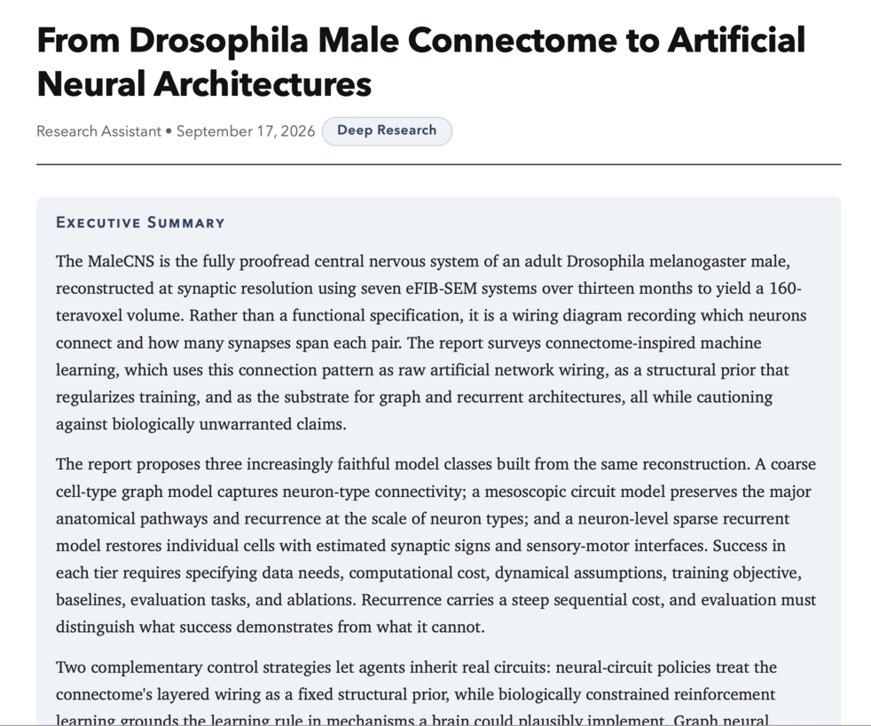
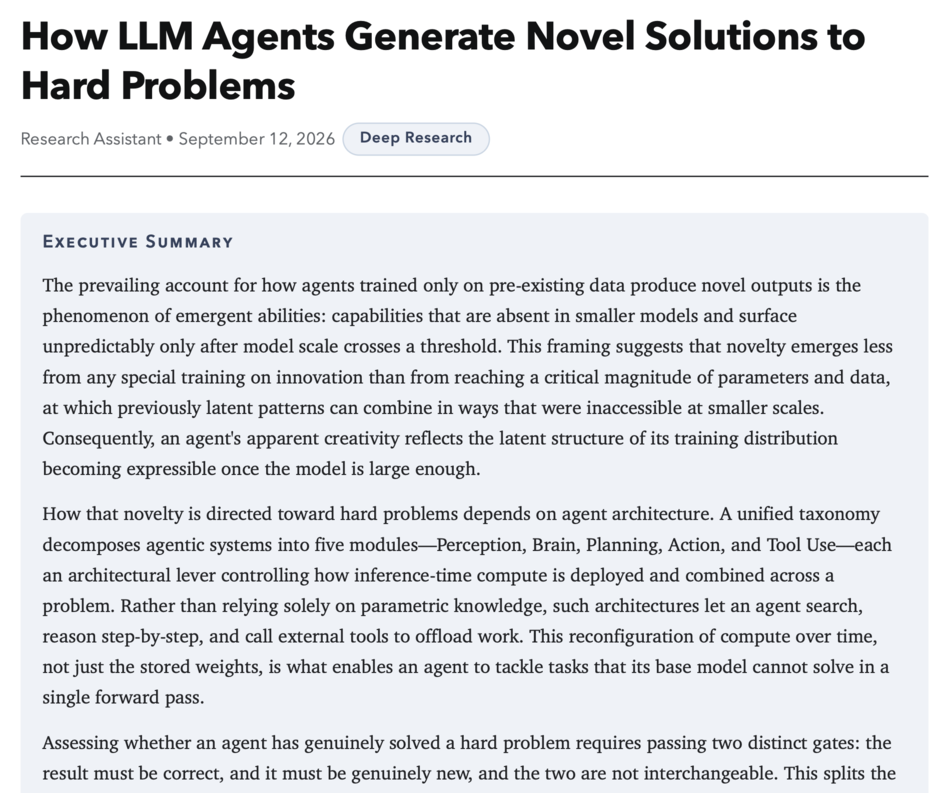
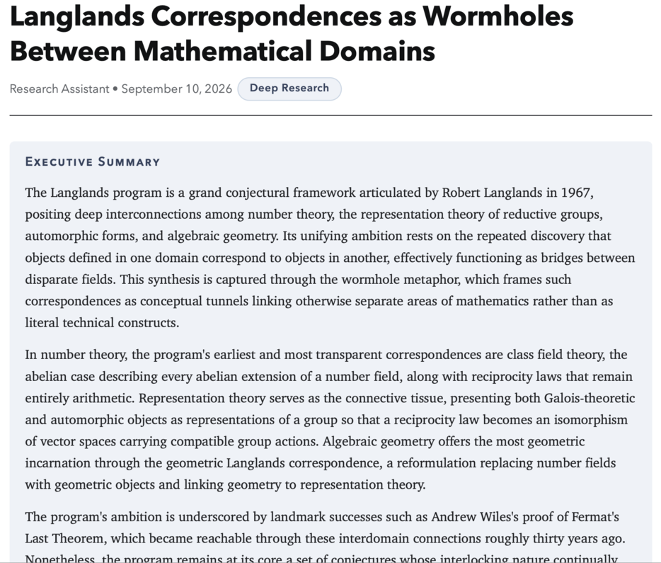

# Deep Reach

This is a tool for performing deep research on the web, optionally augmented with local documents (RAG-style). This is similar to the "deep research" queries available with foundation models; the difference is that Deep Reach can be run locally - for both LLM compute resources and web search by way of SearXNG. Whereas foundation labs limit the number of deep research queries allowed each day - especially on the free tier - Deep Reach can be run completely free and without limits.

## Example reports

Some example reports generated locally using a 35B LLM model:

<table>
<tr>
<td align="center" valign="top">
<a href="docs/from_drosophila_male_connectome_to_artificial_neural_architectures.pdf"></a><br>
<strong>From Drosophila Male Connectome to Artificial Neural Architectures</strong><br>
September 17, 2026<br>
<a href="docs/from_drosophila_male_connectome_to_artificial_neural_architectures.pdf">open PDF</a>
</td>
<td align="center" valign="top">
<a href="docs/how_llm_agents_generate_novel_solutions_to_hard_problems.pdf"></a><br>
<strong>How LLM Agents Generate Novel Solutions to Hard Problems</strong><br>
September 12, 2026<br>
<a href="docs/how_llm_agents_generate_novel_solutions_to_hard_problems.pdf">open PDF</a>
</td>
</tr>
<tr>
<td align="center" valign="top">
<a href="docs/langlands_correspondences_as_wormholes_between_mathematical_domains.pdf"></a><br>
<strong>Langlands Correspondences as Wormholes Between Mathematical Domains</strong><br>
September 10, 2026<br>
<a href="docs/langlands_correspondences_as_wormholes_between_mathematical_domains.pdf">open PDF</a>
</td>
<td></td>
</tr>
</table>

## Usage

```sh
./run.sh start          # start all 4 (dependency order), wait for ports, print summary
./run.sh stop           # stop all 4 (reverse order), verify ports are free
./run.sh restart        # stop + start
./run.sh status         # pid / port / health / UP-DOWN table
./run.sh logs worker    # tail logs/worker.log (200 lines, follow)
./run.sh logs           # 30-line snapshot of all logs
./run.sh help
```

## Services

| service   | dir                 | runtime | command                     | port | health            |
|-----------|---------------------|---------|-----------------------------|------|-------------------|
| worker    | `deep-reach-worker` | python  | `venv/bin/python api_server.py` | 8321 | `/health`        |
| backend   | `deep-reach-backend`| node    | `npm run serve`             | 8322 | TCP (optionally `/openapi.json`) |
| api       | `deep-reach-api`    | bun     | `bun run src/index.ts`      | 8320 | `/health`         |
| web       | `deep-reach-web`    | node    | `npm run dev`               | 8323 | `/`               |

Dependency wiring: **web → api → { worker, backend }** — the web app rewrites `/api/*` to the glue api service, which proxies to the worker and backend.

PIDs live in `logs/<service>.pid`, output in `logs/<service>.log`. Services that are already running are skipped; a missing runtime (e.g. no `bun`) warns and skips that service without aborting the run.

## External LLM dependency

The worker calls an external OpenAI-compatible LLM at `LLM_ENDPOINT` in `deep-reach-worker/utils/var.env` (default `http://localhost:8080`). Run that LLM server separately — if it is unreachable, the worker stays up but research requests will fail. `./run.sh start` prints a (non-fatal) warning when the endpoint is down. API keys now live in the OS keychain (service `deep-reach`) — `var.env` keeps only non-secret settings, and a worker restart migrates any plaintext keys still in it into the keyring.
